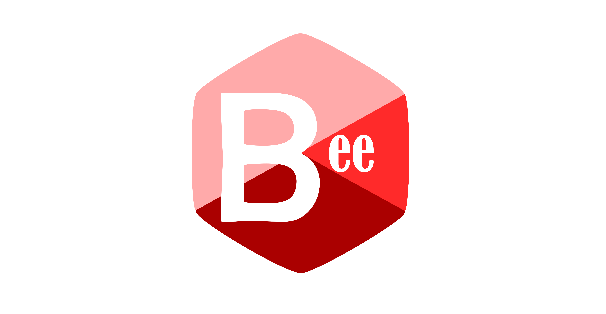

# Bee Compiler

Compiler for Bee programming language written in C.

## What is Bee ?
Bee is a C-style programming language, closely ressembling B (auto keyword)

## Progress so far
- [x] Working Lexer
- [x] Working Parser
- [ ] Support for every operations
- [ ] Assembly code generation